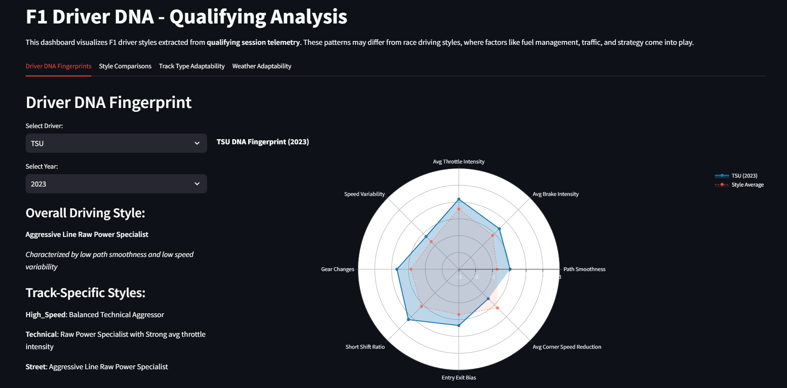
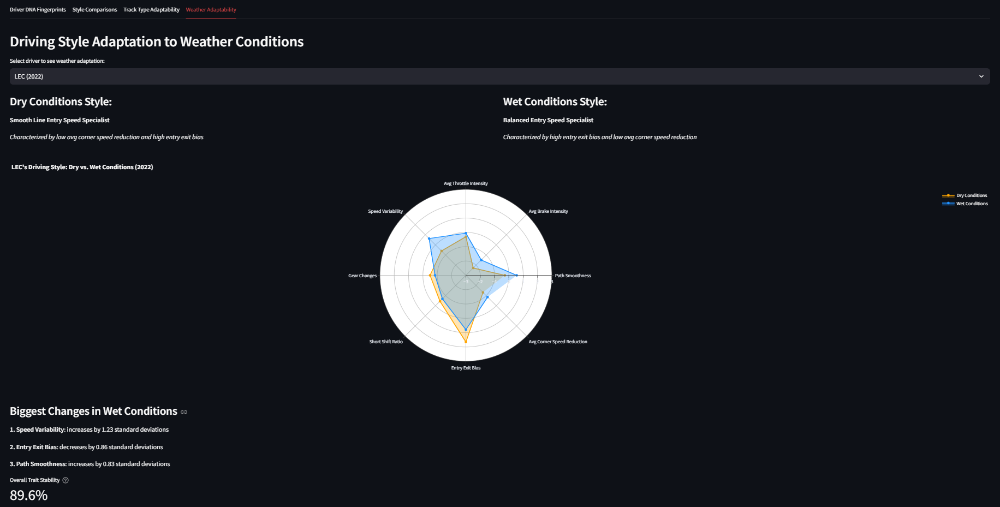

# F1 Driver DNA Analysis

This project analyzes Formula 1 drivers' telemetry data to identify distinctive driving styles and patterns. Using machine learning (clustering analysis), the project classifies drivers into different style categories and examines how these styles adapt across:

- Different track types (high-speed, technical, street)
- Weather conditions (dry, wet)
- Seasons (2022-2023)

## Features

- **Driver DNA Extraction**: Processes telemetry data to extract meaningful features
- **Style Classification**: Uses unsupervised learning to identify natural driving style clusters
- **Track Type Analysis**: Examines how drivers adapt to different circuit characteristics
- **Weather Adaptation**: Compares driving approaches in dry vs. wet conditions
- **Interactive Dashboard**: Visualizes all findings through an intuitive Streamlit interface

## Dashboard Preview

### Driver DNA Fingerprint

*Visualizing a driver's unique style characteristics across multiple dimensions*

### Weather Adaptation

*Changes in driving style between dry and wet conditions*

## Data Source

This project uses the [FastF1](https://github.com/theOehrly/Fast-F1) Python package to access official Formula 1 timing data.

## Installation

```bash
# Clone the repository
git clone https://github.com/nassimch12/F1-Driver-DNA.git
cd F1-Driver-DNA

# Install dependencies
pip install -r requirements.txt

```

## Usage
Run the analysis notebook to generate the driver DNA data:

jupyter notebook driver_dna.ipynb

Launch the interactive dashboard:

streamlit run driver_dna_dashboard.py

## License
This project is licensed under the MIT License - see the LICENSE file for details.

Disclaimer

## Disclaimer

This project is unofficial and is not associated in any way with the Formula 1 companies. F1, FORMULA ONE, FORMULA 1, FIA FORMULA ONE WORLD CHAMPIONSHIP, GRAND PRIX and related marks are trade marks of Formula One Licensing B.V.

This project uses the FastF1 Python package to access timing data and is intended for educational and research purposes only.